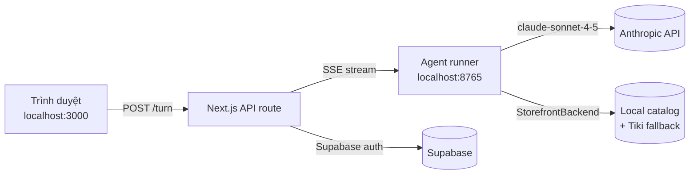

# Toolify

> Trợ lý mua sắm AI cho người Việt — tìm sản phẩm, so sánh giá, hỏi đáp bằng tiếng Việt tự nhiên.

[](https://github.com/ducnolag/Startup-BA)
[](LICENSE)
[](apps/agent-runner)
[](apps/web)

## Toolify là gì?

Bạn mở Tiki/Shopee/Lazada, lướt ba trang cùng lúc, copy-paste link sang tab chat để hỏi "có nên mua không?" — rồi quên mất sản phẩm đang xem.

Toolify gom tất cả vào một khung chat. Bạn hỏi bằng tiếng Việt, Claude trả lời kèm sản phẩm, so sánh giá, và gợi ý dựa trên sở thích của bạn. Không cần mở tab mới.

Đây là monorepo gồm:

- **`apps/agent-runner/`** — Python HTTP server bọc Anthropic SDK + commerce-agents ShoppingAgent, expose SSE streaming.
- **`apps/web/`** — Next.js 14 frontend (App Router, Tailwind, Framer Motion).
- **`services/`** — chỗ để dành cho merchant agent và các services tương lai.

## Quickstart với Docker (5 phút)

Yêu cầu: Docker Desktop đang chạy.

```bash
git clone https://github.com/ducnolag/Startup-BA.git
cd Startup-BA
cp .env.example .env
# Mở .env và dán ANTHROPIC_API_KEY của bạn vào.
docker-compose up -d
```

Mở [http://localhost:3000/agent](http://localhost:3000/agent) để bắt đầu chat. Agent runner lắng nghe ở `http://localhost:8765` (health check tại `/health`).

Muốn xem log theo thời gian thực:

```bash
docker-compose logs -f agent-runner
docker-compose logs -f web
```

Tắt stack: `docker-compose down`.

## Cài thủ công (dev mode, hot-reload)

Nếu muốn edit code và thấy thay đổi ngay không cần rebuild image:

### Terminal 1 — Agent runner

```bash
cd apps/agent-runner
python -m venv .venv
.\.venv\Scripts\Activate.ps1     # PowerShell
# source .venv/bin/activate      # bash / zsh

pip install -r requirements.txt
python -m agent_runner.runner
```

Server chạy ở `http://localhost:8765`. Sửa code trong `apps/agent-runner/agent_runner/` → runner không tự reload (nhấn Ctrl+C rồi chạy lại).

### Terminal 2 — Next.js

```bash
cd apps/web
npm install
npm run dev
```

Mở [http://localhost:3000](http://localhost:3000). Sửa code trong `app/`, `components/`, `lib/` → Next.js tự reload trong trình duyệt.

## Kiến trúc



- Browser chat với Next.js, Next.js proxy request sang agent runner.
- Agent runner wrap commerce-agents ShoppingAgent (vendored trong `apps/agent-runner/`).
- ShoppingAgent gọi Claude API cho LLM, gọi `VNBackend` (xem `apps/agent-runner/agent_core.py`) cho product search/cart.
- Local catalog 18 sản phẩm mẫu + Tiki API fallback khi query không khớp local data.

## Cấu trúc project

```
Startup-BA/
├── apps/
│   ├── agent-runner/         # Python 3.12, FastAPI-style HTTP server
│   │   ├── agent_runner/     # Module chính: runner, agent_core, catalog
│   │   ├── shopping_agent/   # Vendored commerce-agents core
│   │   ├── shopping_agent_runtime/  # Vendored orchestrator
│   │   ├── commerce_common/  # Vendored shared types
│   │   ├── skills/           # Skill definitions (search, compare, …)
│   │   ├── tests/
│   │   ├── requirements.txt
│   │   ├── pyproject.toml
│   │   ├── Dockerfile
│   │   └── README.md
│   └── web/                  # Next.js 14 (App Router)
│       ├── app/              # Routes: /, /agent, /admin, /dashboard, /api/…
│       ├── components/
│       ├── lib/
│       ├── public/
│       ├── supabase/
│       ├── package.json
│       ├── next.config.mjs
│       ├── tailwind.config.ts
│       ├── Dockerfile
│       └── README.md
├── docs/                     # Tài liệu kiến trúc, design notes
├── services/                 # Services tương lai (merchant-agent, …)
├── scripts/                  # Helper scripts (build, deploy, …)
├── .github/workflows/        # CI/CD
├── .gitignore
├── .dockerignore
├── .env.example
├── docker-compose.yml        # Production-like orchestration
├── docker-compose.dev.yml    # Dev overrides (hot reload)
├── LICENSE
└── README.md
```

## Tech stack

**Agent runner (Python)**

- Python 3.12, Starlette + SSE-Starlette (async HTTP + streaming)
- Anthropic SDK 0.122
- commerce-agents ShoppingAgent (vendored core + runtime)
- Pydantic 2.13 cho schemas

**Web (Next.js)**

- Next.js 14 (App Router) + TypeScript
- Tailwind CSS, Framer Motion, GSAP, Lenis
- React Three Fiber / Drei (3D hero — đang phát triển)
- Supabase SSR cho auth + database

**Deployment**

- Docker multi-stage builds
- docker-compose cho local + production-like
- GitHub Actions CI (xem `.github/workflows/`)

## Scripts hữu ích

```bash
# Verify Python imports không bị gãy sau khi edit code
cd apps/agent-runner
python -c "from agent_runner.runner import run_server; print('OK')"

# Type-check Next.js (cần đã chạy npm install)
cd apps/web
npx tsc --noEmit

# Build production image mà không chạy container
docker-compose build

# Chạy dev compose (override volume mounts + disable healthcheck)
docker-compose -f docker-compose.yml -f docker-compose.dev.yml up
```

## Roadmap

- [ ] 3D hero section bằng React Three Fiber
- [ ] Multi-platform: thêm Shopee, Lazada APIs ngoài Tiki
- [ ] User authentication + lưu lịch sử chat (Supabase)
- [ ] Production deployment lên fly.io / Railway
- [ ] Webhook từ merchant-agent (services/ tương lai)

## Đóng góp

Xem [CONTRIBUTING.md](CONTRIBUTING.md). Tóm tắt:

1. Fork repo, tạo branch từ `main`.
2. Edit code trong `apps/agent-runner/` hoặc `apps/web/`.
3. Chạy `ruff check .` (Python) và `npm run lint` (Next.js) trước khi commit.
4. Mở PR mô tả thay đổi + screenshot nếu có UI change.

## License

Apache 2.0 — xem [LICENSE](LICENSE).
